# 42-projects-overview
This repository contains a list of all the projects I have done at 42 Lausanne.

## **Program Overview**
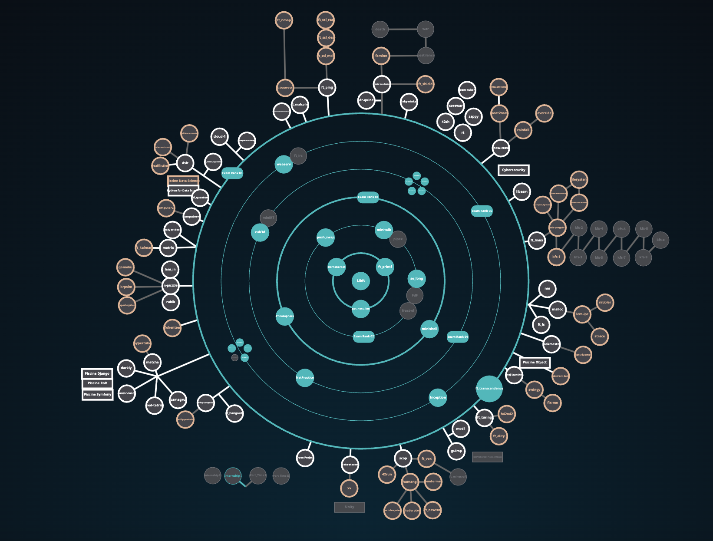

The 42 School program is structured around a central project, `libft`, which serves as the entry point for students. 
It's designed to progressively unlock more advanced projects, organized into concentric circles that represent different levels of achievement and complexity.

- Blue circle are **validated projects**.
- White circle are **accessible projects**.
- Grey circle are **locked projects**.

## **How It Works**
##### **Starting Point:**
- The journey begins with the `libft` project located at the center of the chart.
- Successfully completing libft unlocks access to the first circle of projects.

##### **Progression Through Circles:**
- Each circle represents a new level of projects that must be completed before moving on to the next.
- Projects in the inner circles are prerequisites for those in the outer circles.
- Students must validate (complete and pass) each project within a circle to progress to the next one.

##### **Common Core:**
- The common core is completed when **all projects in all circles have been validated.**
- This marks the end of the core curriculum and the beginning of specialization options.

##### **Specialization:**
- After finishing the common core, students can choose from various specialized tracks based on their interests and career goals.

## My Common Core Projects
Be careful, some projects may not be up to date with the latest 42 program.

##### **Circle 2:**
<a href="https://github.com/Bima42/push_swap" target="_blank">
    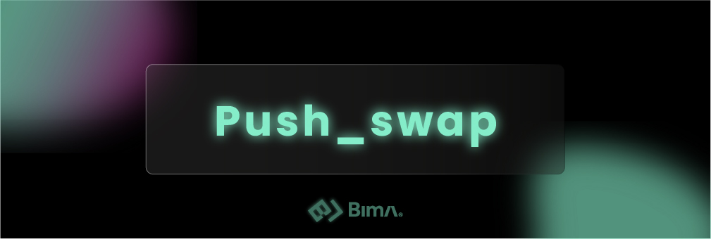
</a>

<a href="https://github.com/Bima42/so_long" target="_blank">
    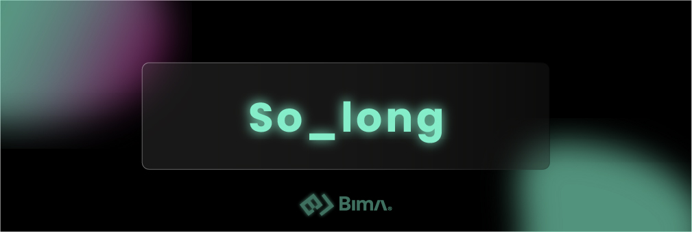
</a>

##### **Circle 3:**
<a href="https://github.com/Bima42/minishell" target="_blank">
    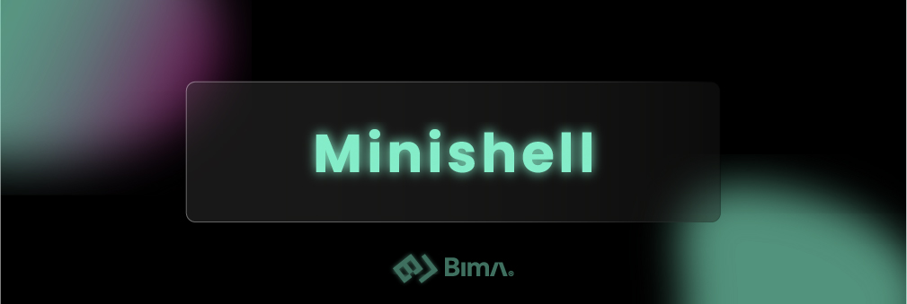
</a>

<a href="https://github.com/Bima42/philosophers" target="_blank">
    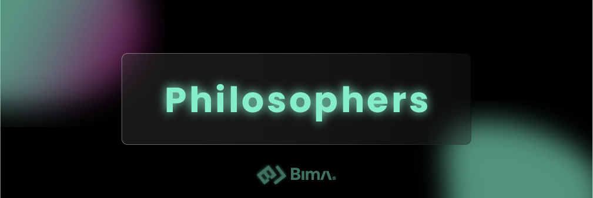
</a>

##### **Circle 4:**
<a href="https://github.com/Bima42/cub3d" target="_blank">
    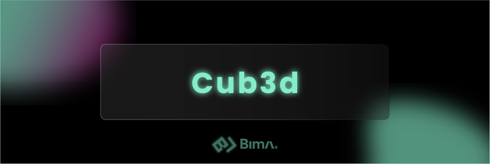
</a>

<a href="https://github.com/Bima42/NetPractice" target="_blank">
    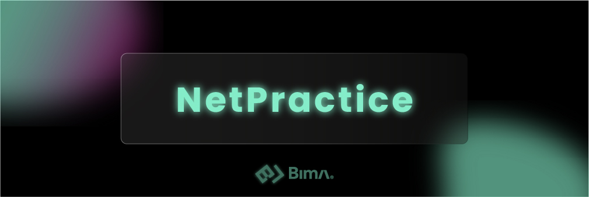
</a>

<a href="https://github.com/Bima42/cpp_modules" target="_blank">
    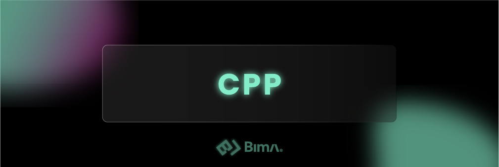
</a>

##### **Circle 5:**
<a href="https://github.com/Bima42/inception" target="_blank">
    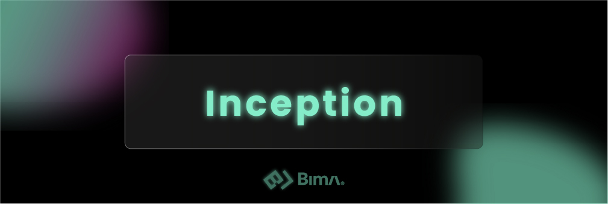
</a>

<a href="https://github.com/Bima42/webserv" target="_blank">
    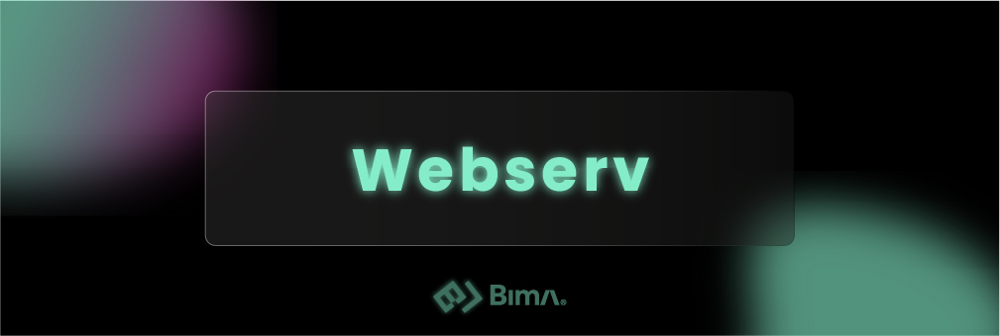
</a>

##### **Circle 6:**
<a href="https://github.com/Bima42/ft_transcendence" target="_blank">
    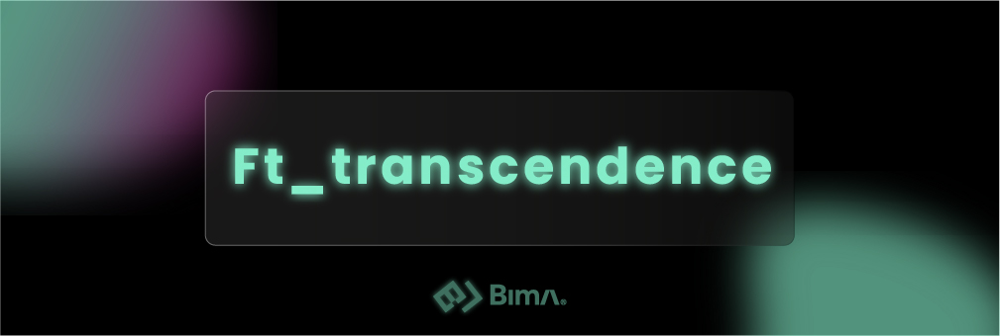
</a>

##### **Exam Rank:**
<a href="https://github.com/Bima42/42-exam-rank" target="_blank">
    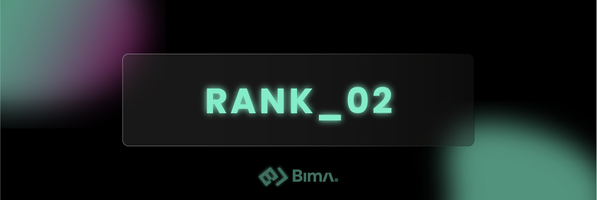
</a>

<a href="https://github.com/Bima42/42-exam-rank" target="_blank">
    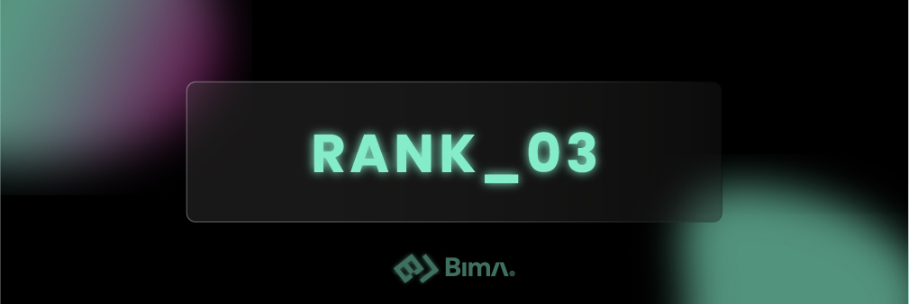
</a>

<a href="https://github.com/Bima42/42-exam-rank" target="_blank">
    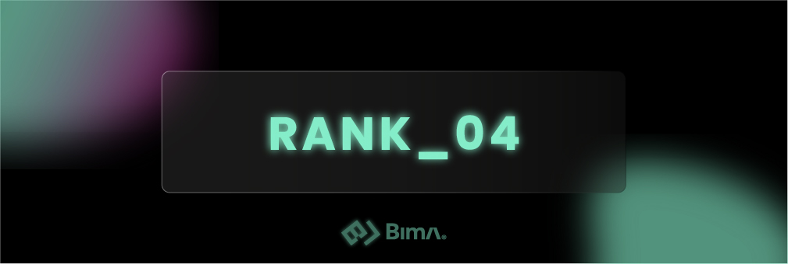
</a>

